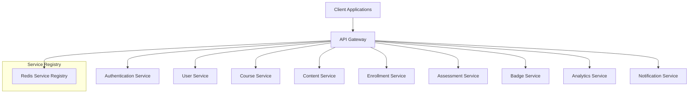
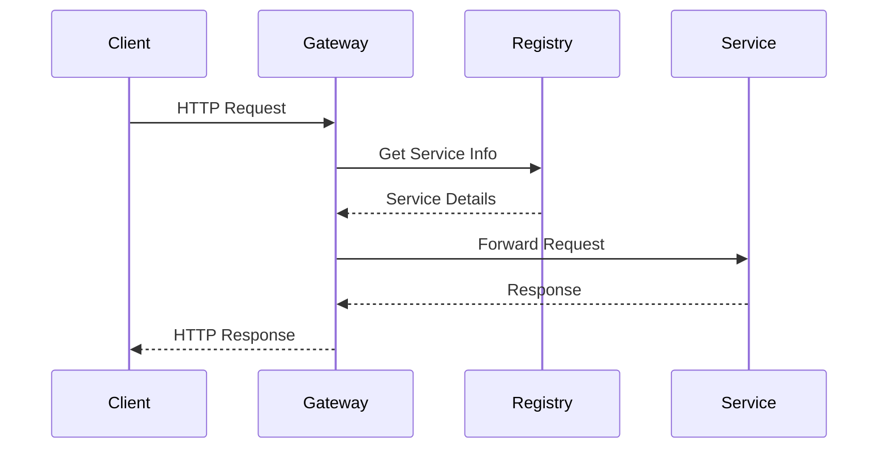
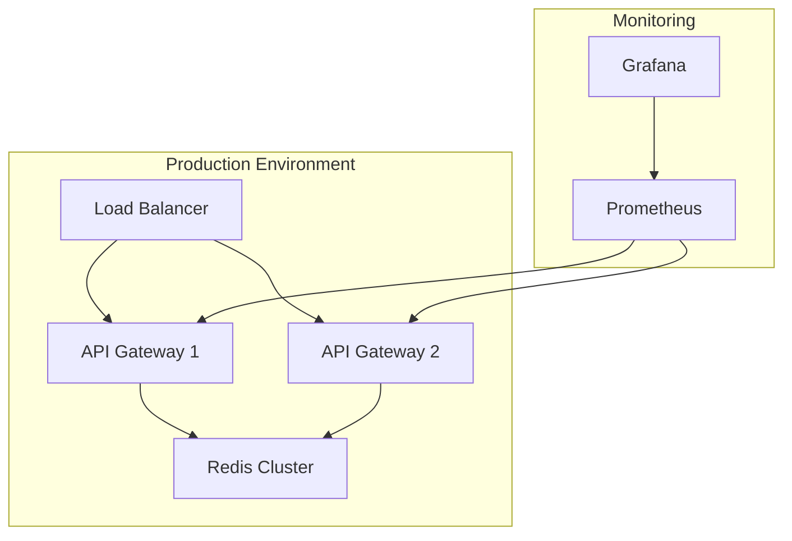

# API Gateway Architecture Overview

## System Architecture

The API Gateway follows a microservices architecture pattern, acting as the central entry point for all client requests. It is designed to be scalable, maintainable, and resilient.

## Core Components

### 1. Service Registry
- **Purpose**: Manages service discovery and health monitoring
- **Implementation**: Redis-based service registry
- **Key Features**:
  - Service registration and deregistration
  - Health check monitoring
  - Service metadata management
  - Load balancing information

### 2. Request Router
- **Purpose**: Routes requests to appropriate services
- **Implementation**: FastAPI router with dynamic route generation
- **Key Features**:
  - Path-based routing
  - Service discovery integration
  - Request transformation
  - Error handling

### 3. Authentication Middleware
- **Purpose**: Handles authentication and authorization
- **Implementation**: JWT-based authentication
- **Key Features**:
  - Token validation
  - Role-based access control
  - Session management
  - Security headers

### 4. Monitoring System
- **Purpose**: Tracks system health and performance
- **Implementation**: OpenTelemetry integration
- **Key Features**:
  - Request tracing
  - Performance metrics
  - Error tracking
  - Health status reporting

## Data Flow

## Security Architecture

1. **Authentication**
   - JWT token validation
   - Session management
   - Token refresh mechanism

2. **Authorization**
   - Role-based access control
   - Permission validation
   - Resource access control

3. **Request Security**
   - Rate limiting
   - CORS management
   - Input validation
   - XSS protection

## Scalability Considerations

1. **Horizontal Scaling**
   - Stateless design
   - Load balancing support
   - Service discovery

2. **Performance**
   - Caching strategies
   - Connection pooling
   - Request batching

3. **Resilience**
   - Circuit breaking
   - Retry mechanisms
   - Fallback strategies

## Monitoring and Observability

1. **Metrics**
   - Request latency
   - Error rates
   - Service health
   - Resource usage

2. **Logging**
   - Request/response logging
   - Error logging
   - Audit logging
   - Performance logging

3. **Tracing**
   - Request tracing
   - Service dependencies
   - Performance bottlenecks
   - Error tracking

## Deployment Architecture

## Future Considerations

1. **Planned Improvements**
   - GraphQL support
   - WebSocket support
   - Enhanced caching
   - Advanced rate limiting

2. **Scalability Enhancements**
   - Regional deployment
   - Multi-cluster support
   - Enhanced load balancing
   - Performance optimizations

3. **Security Enhancements**
   - Advanced authentication
   - Enhanced authorization
   - Security monitoring
   - Compliance features 