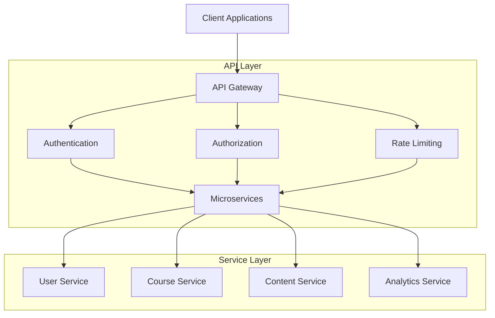
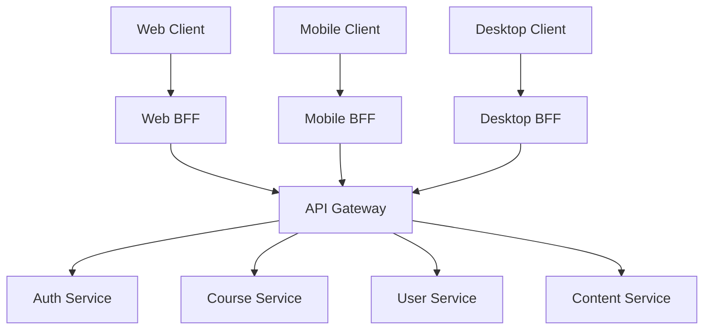
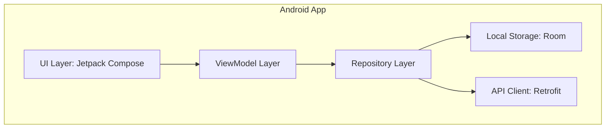
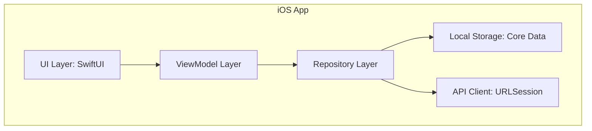
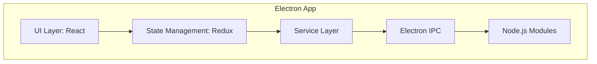
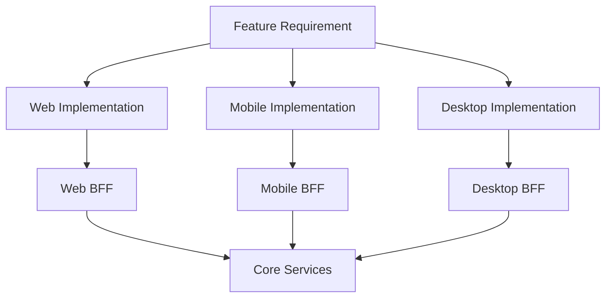

# System Patterns: Multi-Tenant LMS

## 1. Architecture Overview

The LMS will be designed using a **multi-tenant architecture**, likely employing a **database-per-tenant** or a **shared-database-with-schema-per-tenant** approach to ensure strong data isolation between different organizations (tenants).

A **microservices architecture** could be considered for scalability and maintainability, separating concerns like User Management, Course Management, Content Delivery, Analytics, and Notifications.

The system will be **web-based**, accessible via modern browsers, with a **responsive design** for mobile and tablet use.

## 2. Key Design Patterns & Principles

- **Multi-Tenancy:** Core to the system. Mechanisms needed for:
  - Tenant Provisioning (creating new organizations)
  - Tenant Identification (routing requests to the correct tenant data)
  - Data Isolation (preventing data leakage between tenants)
  - Tenant Configuration (custom settings/branding per tenant)
- **Role-Based Access Control (RBAC):** A robust permission system will control access based on user roles (Org Admin, Branch Manager, Teacher, Student) within their respective tenant and branch context.
- **Hierarchical Data Model:** The data structure will reflect the Organization -> Branch -> Class -> User hierarchy.
- **Repository Pattern:** To abstract data access logic, allowing for easier changes to the underlying data storage.
- **Service Layer:** Business logic will be encapsulated in service layers to separate it from the controllers/API endpoints.
- **Asynchronous Processing:** Background jobs (using queues like RabbitMQ or Redis) will handle long-running tasks like report generation, bulk imports, and sending notifications to avoid blocking user requests.
- **API-First Design:** Core functionality will be exposed via APIs to support potential future integrations or native mobile applications.
- **Event-Driven Architecture (Optional):** For complex interactions between microservices, an event-driven approach could enhance decoupling and resilience.

## 3. Component Relationships (Conceptual)

```mermaid
flowchart TD
  User[User (Browser/Mobile)] --> LoadBalancer[Load Balancer]
  LoadBalancer --> API_Gateway[API Gateway / BFF]

  subgraph Backend Services
    API_Gateway --> AuthN[Auth Service]
    API_Gateway --> TenantMgmt[Tenant Mgmt Service]
    API_Gateway --> UserMgmt[User Mgmt Service]
    API_Gateway --> BranchMgmt[Branch Mgmt Service]
    API_Gateway --> CourseMgmt[Course Mgmt Service]
    API_Gateway --> ContentMgmt[Content Service]
    API_Gateway --> Analytics[Analytics Service]
    API_Gateway --> Notification[Notification Service]

    UserMgmt --> DB_Users[(User DB)]
    TenantMgmt --> DB_Tenants[(Tenant Config DB)]
    BranchMgmt --> DB_Branches[(Branch DB / Tenant DB)]
    CourseMgmt --> DB_Courses[(Course DB / Tenant DB)]
    ContentMgmt --> ObjectStorage[(Object Storage)]
    Analytics --> DataWarehouse[(Data Warehouse)]
    Notification --> Queue[Message Queue]

    %% Tenant Data Stores   * could be separate DBs or schemas
    subgraph Tenant A Data
    DB_Branches_A[(Branch Data A)]
    DB_Courses_A[(Course Data A)]
    %% ... other tenant-specific data
    end
    subgraph Tenant B Data
    DB_Branches_B[(Branch Data B)]
    DB_Courses_B[(Course Data B)]
    %% ... other tenant-specific data
    end

    BranchMgmt --> Tenant A Data
    CourseMgmt --> Tenant A Data
    BranchMgmt --> Tenant B Data
    CourseMgmt --> Tenant B Data
  end

  Notification --> Email[Email Service]
  Notification --> Push[Push Notification Service]

  Analytics --> ReportingUI[Reporting UI]
```

_Note: This is a high-level conceptual diagram. Actual implementation might vary based on chosen multi-tenancy strategy and microservice boundaries._

## 4. Data Management

- **Database Choice:** A relational database (like PostgreSQL) is suitable for structured data and transactional integrity. A NoSQL database might be used for specific needs like analytics or user session management.
- **Data Isolation Strategy:** Requires careful consideration (Separate Databases vs. Shared Database/Schema). This decision impacts cost, complexity, and isolation level.
- **Backup & Recovery:** Regular automated backups and a clear disaster recovery plan are essential.
- **Data Archiving:** Strategy for archiving old data (e.g., inactive courses, user records) to maintain performance.

## Badge and Certificate System Patterns

### Design Patterns

1. **Observer Pattern**

   - Badge progress monitoring
   - Achievement notifications
   - Real-time updates
   - Event tracking

2. **Factory Pattern**

   - Badge creation
   - Certificate generation
   - Template management
   - Social media integration

3. **Strategy Pattern**

   - Verification methods
   - Progress calculation
   - Sharing strategies
   - Template rendering

4. **Decorator Pattern**
   - Badge customization
   - Certificate styling
   - Social media formatting
   - Verification enhancement

### Component Relationships

1. **Badge System**

```code
BadgeDefinition -> BadgeProgress -> EarnedBadge
   ↓      ↓      ↓
CriteriaCheck <* ProgressTracker <* Achievement
```

2. **Certificate System**

```code
CertificateTemplate -> CertificateGenerator -> IssuedCertificate
    ↓        ↓        ↓
TemplateFields <* DynamicContent <* VerificationCode
```

3. **Social Integration**

```code
Achievement -> SocialMediaService -> PlatformAdapter
  ↓     ↓      ↓
ShareContent <* FormatContent <* PlatformSpecific
```

### Data Flow

1. **Badge Progress**

```code
User Action -> Progress Update -> Criteria Check -> Badge Award
  ↓      ↓      ↓      ↓
EventEmitter -> Cache Update -> Validation -> Notification
```

2. **Certificate Generation**

```code
Completion -> Template Selection -> Content Generation -> PDF Creation
  ↓      ↓      ↓      ↓
Validation -> Field Mapping -> Dynamic Data -> Digital Sign
```

3. **Verification Flow**

```code
Request -> Code Validation -> Certificate Check -> Response
  ↓    ↓      ↓      ↓
RateLimit -> Cache Check -> Blockchain Verify -> Logging
```

### Integration Patterns

1. **Event-Driven**

   - Progress updates
   - Achievement notifications
   - Verification requests
   - Social sharing

2. **API-First**

   - RESTful endpoints
   - GraphQL queries
   - WebSocket updates
   - Webhook notifications

3. **Caching Strategy**
   - Redis for progress
   - CDN for certificates
   - Memory cache for templates
   - Distributed caching

## API Architecture Patterns

### API Design Principles

1. **RESTful Architecture**

   - Resource-oriented endpoints
   - Stateless communication
   - HTTP method semantics
   - Standard status codes
   - HATEOAS principles

2. **API Gateway Pattern**

   - Request routing
   - Load balancing
   - Rate limiting
   - Authentication/Authorization
   - Request/Response transformation

3. **Versioning Strategy**

   - URL path versioning
   - Backward compatibility
   - Version deprecation policy
   - Multiple version support

4. **Security Patterns**
   - JWT authentication
   - Role-based access control
   - API key management
   - Rate limiting
   - CORS policies

### API Component Organization



### API Resource Hierarchy

```code
/api/v1/
├── auth/       # Authentication endpoints
├── organizations/    # Organization management
│ └── {orgId}/
│   ├── branches/   # Branch management
│   ├── users/    # User management
│   └── settings/   # Organization settings
├── courses/     # Course management
│ └── {courseId}/
│   ├── content/   # Course content
│   ├── enrollments/ # Course enrollments
│   └── analytics/ # Course analytics
├── content/     # Content management
├── assessments/   # Assessment management
├── badges/     # Badge management
├── certificates/    # Certificate management
├── analytics/    # Analytics endpoints
├── notifications/  # Notification management
└── integrations/   # Integration endpoints
```

### API Design Patterns

1. **Repository Pattern**

   - Data access abstraction
   - Consistent data operations
   - Query optimization
   - Cache integration

2. **Service Layer Pattern**

   - Business logic encapsulation
   - Transaction management
   - Cross-cutting concerns
   - Service composition

3. **DTO Pattern**

   - Data transfer objects
   - Request/Response mapping
   - Validation
   - Version control

4. **CQRS Pattern**
   - Command/Query separation
   - Read/Write optimization
   - Event sourcing
   - Data consistency

### API Integration Patterns

1. **Event-Driven Integration**

   - Message queues
   - Pub/Sub systems
   - Event sourcing
   - Async communication

2. **Synchronous Integration**

   - REST APIs
   - GraphQL
   - gRPC
   - WebSocket

3. **Caching Patterns**

   - Response caching
   - Distributed caching
   - Cache invalidation
   - Cache consistency

4. **Error Handling Patterns**
   - Global error handling
   - Error categorization
   - Error reporting
   - Recovery strategies

### API Security Patterns

1. **Authentication Patterns**

   - JWT-based auth
   - OAuth2 flows
   - API key management
   - Session management

2. **Authorization Patterns**

   - Role-based access
   - Resource-based access
   - Permission management
   - Policy enforcement

3. **Data Protection Patterns**

   - Encryption at rest
   - Encryption in transit
   - Data masking
   - Secure headers

4. **Monitoring Patterns**
   - Request logging
   - Performance monitoring
   - Security auditing
   - Error tracking

## API Endpoints

### Authentication & Authorization

```
POST /api/v1/auth/login
POST /api/v1/auth/register
POST /api/v1/auth/refresh-token
POST /api/v1/auth/logout
POST /api/v1/auth/forgot-password
POST /api/v1/auth/reset-password
GET /api/v1/auth/me
```

### Organization Management

```
GET /api/v1/organizations
POST /api/v1/organizations
GET /api/v1/organizations/{id}
PUT /api/v1/organizations/{id}
DELETE /api/v1/organizations/{id}
GET /api/v1/organizations/{id}/settings
PUT /api/v1/organizations/{id}/settings
GET /api/v1/organizations/{id}/branches
POST /api/v1/organizations/{id}/branches
```

### Branch Management

```
GET /api/v1/organizations/{orgId}/branches
POST /api/v1/organizations/{orgId}/branches
GET /api/v1/organizations/{orgId}/branches/{id}
PUT /api/v1/organizations/{orgId}/branches/{id}
DELETE /api/v1/organizations/{orgId}/branches/{id}
GET /api/v1/organizations/{orgId}/branches/{id}/settings
PUT /api/v1/organizations/{orgId}/branches/{id}/settings
GET /api/v1/organizations/{orgId}/branches/{id}/users
POST /api/v1/organizations/{orgId}/branches/{id}/users
```

### User Management

```
GET /api/v1/users
POST /api/v1/users
GET /api/v1/users/{id}
PUT /api/v1/users/{id}
DELETE /api/v1/users/{id}
GET /api/v1/users/{id}/profile
PUT /api/v1/users/{id}/profile
GET /api/v1/users/{id}/enrollments
GET /api/v1/users/{id}/progress
GET /api/v1/users/{id}/badges
GET /api/v1/users/{id}/certificates
```

### Course Management

```
GET /api/v1/courses
POST /api/v1/courses
GET /api/v1/courses/{id}
PUT /api/v1/courses/{id}
DELETE /api/v1/courses/{id}
GET /api/v1/courses/{id}/content
POST /api/v1/courses/{id}/content
GET /api/v1/courses/{id}/enrollments
POST /api/v1/courses/{id}/enrollments
GET /api/v1/courses/{id}/progress
GET /api/v1/courses/{id}/analytics
```

### Content Management

```
GET /api/v1/content
POST /api/v1/content
GET /api/v1/content/{id}
PUT /api/v1/content/{id}
DELETE /api/v1/content/{id}
GET /api/v1/content/{id}/versions
POST /api/v1/content/{id}/versions
GET /api/v1/content/{id}/media
POST /api/v1/content/{id}/media
```

### Assessment Management

```
GET /api/v1/assessments
POST /api/v1/assessments
GET /api/v1/assessments/{id}
PUT /api/v1/assessments/{id}
DELETE /api/v1/assessments/{id}
POST /api/v1/assessments/{id}/submit
GET /api/v1/assessments/{id}/results
GET /api/v1/assessments/{id}/analytics
```

### Badge & Certificate Management

```
GET /api/v1/badges
POST /api/v1/badges
GET /api/v1/badges/{id}
PUT /api/v1/badges/{id}
DELETE /api/v1/badges/{id}
GET /api/v1/badges/{id}/progress
POST /api/v1/badges/{id}/award
GET /api/v1/certificates
POST /api/v1/certificates
GET /api/v1/certificates/{id}
GET /api/v1/certificates/{id}/verify
POST /api/v1/certificates/{id}/share
```

### Analytics & Reporting

```
GET /api/v1/analytics/overview
GET /api/v1/analytics/users
GET /api/v1/analytics/courses
GET /api/v1/analytics/assessments
GET /api/v1/analytics/engagement
GET /api/v1/analytics/performance
GET /api/v1/reports
POST /api/v1/reports
GET /api/v1/reports/{id}
GET /api/v1/reports/{id}/download
```

### Notification Management

```
GET /api/v1/notifications
POST /api/v1/notifications
GET /api/v1/notifications/{id}
PUT /api/v1/notifications/{id}
DELETE /api/v1/notifications/{id}
GET /api/v1/notifications/settings
PUT /api/v1/notifications/settings
POST /api/v1/notifications/templates
GET /api/v1/notifications/templates
```

### Integration Endpoints

```
GET /api/v1/integrations
POST /api/v1/integrations
GET /api/v1/integrations/{id}
PUT /api/v1/integrations/{id}
DELETE /api/v1/integrations/{id}
POST /api/v1/integrations/{id}/webhooks
GET /api/v1/integrations/{id}/webhooks
POST /api/v1/integrations/{id}/sync
```

### API Response Format

All API responses follow a consistent format:

```json
{
  "success": true,
  "data": {
    // Response data
  },
  "meta": {
    "page": 1,
    "per_page": 10,
    "total": 100
  },
  "error": null
}
```

### Error Response Format

Error responses follow a consistent format:

```json
{
  "success": false,
  "data": null,
  "meta": null,
  "error": {
    "code": "ERROR_CODE",
    "message": "Human readable error message",
    "details": {
      // Additional error details
    }
  }
}
```

### API Versioning

- API versioning is handled through URL path: `/api/v1/`
- Breaking changes will increment the version number
- Multiple versions can be supported simultaneously
- Deprecated versions will be announced 6 months in advance

### Rate Limiting

- Rate limits are applied per API key and IP address
- Default limits:
  - 1000 requests per minute for authenticated users
  - 100 requests per minute for unauthenticated users
- Rate limit headers are included in all responses:
  - `X-RateLimit-Limit`
  - `X-RateLimit-Remaining`
  - `X-RateLimit-Reset`

### Authentication

- All endpoints except public ones require authentication
- Authentication is handled via JWT tokens
- Tokens are passed in the Authorization header:
  - `Authorization: Bearer <token>`
- Refresh tokens are used for long-term sessions
- API keys are used for service-to-service communication

### Pagination

- List endpoints support pagination
- Pagination parameters:
  - `page`: Page number (default: 1)
  - `per_page`: Items per page (default: 10, max: 100)
- Pagination metadata is included in the response

### Filtering

- List endpoints support filtering
- Filter parameters use the format: `filter[field]=value`
- Multiple filters can be combined
- Supported operators:
  - `eq`: Equal to
  - `ne`: Not equal to
  - `gt`: Greater than
  - `lt`: Less than
  - `gte`: Greater than or equal to
  - `lte`: Less than or equal to
  - `in`: In array
  - `nin`: Not in array
  - `like`: Like pattern
  - `ilike`: Case-insensitive like pattern

### Sorting

- List endpoints support sorting
- Sort parameters use the format: `sort=field` or `sort=-field`
- Multiple sort fields can be combined with commas
- Descending order is indicated with a minus sign

### Field Selection

- Response fields can be selected using the `fields` parameter
- Multiple fields can be combined with commas
- Nested fields use dot notation
- Example: `fields=id,name,user.email`

### Error Codes

Common error codes:

- `400`: Bad Request
- `401`: Unauthorized
- `403`: Forbidden
- `404`: Not Found
- `409`: Conflict
- `422`: Unprocessable Entity
- `429`: Too Many Requests
- `500`: Internal Server Error
- `503`: Service Unavailable

## BFF and Client Platform Patterns

### BFF (Backend For Frontend) Pattern



1. **Key Characteristics**

   - Purpose-built backends for each frontend client type
   - Tailored response formats and optimized data transfer
   - Client-specific API contract and versioning
   - Coordinated development with client teams

2. **Implementation Approach**

   - **Aggregation Layer**

     - Combine multiple backend responses into a single client-optimized response
     - Reduce network roundtrips for client applications
     - Optimize payload size for specific client constraints

   - **Translation Layer**
     - Transform backend data models to client-friendly formats
     - Handle backwards compatibility for older client versions
     - Provide client-specific data enrichment

3. **Client-Specific Optimizations**

   - **Mobile BFF**

     - Bandwidth-optimized payloads (reduced JSON, fewer fields)
     - Battery-aware operation patterns
     - Push notification integration
     - Offline-first data strategies

   - **Web BFF**

     - SEO-friendly data structures
     - Progressive enhancement support
     - Browser compatibility considerations
     - Single-page application optimizations

   - **Desktop BFF**
     - Richer data models for more powerful UIs
     - Local system integration support
     - Background processing capabilities
     - Extended session management

### Mobile Application Architecture Patterns





1. **Common Patterns**

   - **Clean Architecture**

     - Clear separation of UI, domain, and data layers
     - Use cases orchestrating business logic
     - Dependency injection for testability
     - Unidirectional data flow

   - **Offline-First**

     - Local database as source of truth
     - Background synchronization
     - Conflict resolution strategies
     - Progressive data loading

   - **Reactive Programming**
     - Observable data streams
     - UI updates based on state changes
     - Event-driven architecture
     - Composition of data sources

2. **Platform-Specific Patterns**

   - **Android**

     - ViewModel with SavedState
     - Jetpack Compose composition
     - WorkManager for background tasks
     - Navigation Component for routing

   - **iOS**
     - SwiftUI state management
     - Combine data processing
     - Core Data persistence
     - Swift concurrency with async/await

### Desktop Application Architecture Patterns



1. **Electron Architecture**

   - **Multi-Process Model**

     - Main process for Node.js capabilities
     - Renderer process for UI rendering
     - IPC communication between processes
     - Preload scripts for security

   - **Web Technologies Integration**
     - Browser-based UI rendering
     - Node.js system access
     - Native module integration
     - Web and desktop hybrid capabilities

2. **Cross-Platform Considerations**

   - **Shared Code Strategy**

     - Core logic in platform-agnostic libraries
     - Platform adapters for OS-specific features
     - Feature detection and capability graceful degradation
     - Consistent state management approach

   - **Native Integration Points**
     - File system access patterns
     - OS notifications integration
     - Hardware acceleration utilization
     - System tray and menu integration

### Cross-Platform Feature Implementation



1. **Feature Consistency Strategy**

   - Core feature contracts and specifications
   - Platform-appropriate implementations
   - Unified testing criteria
   - Feature flag coordination

2. **Implementation Workflow**

   - Feature definition and acceptance criteria
   - Platform-specific design and implementation
   - BFF adaptation for each platform
   - Cross-platform testing and validation

3. **Synchronization Patterns**
   - Offline state sync protocol
   - Cross-device state management
   - Conflict resolution algorithms
   - Real-time collaboration models
