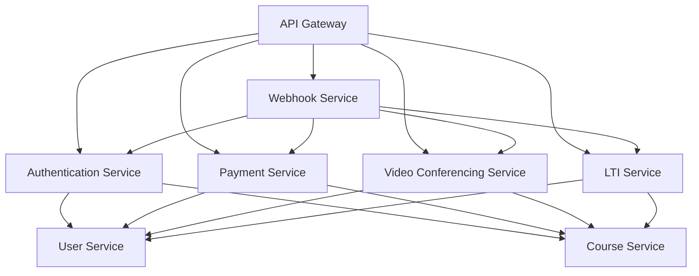
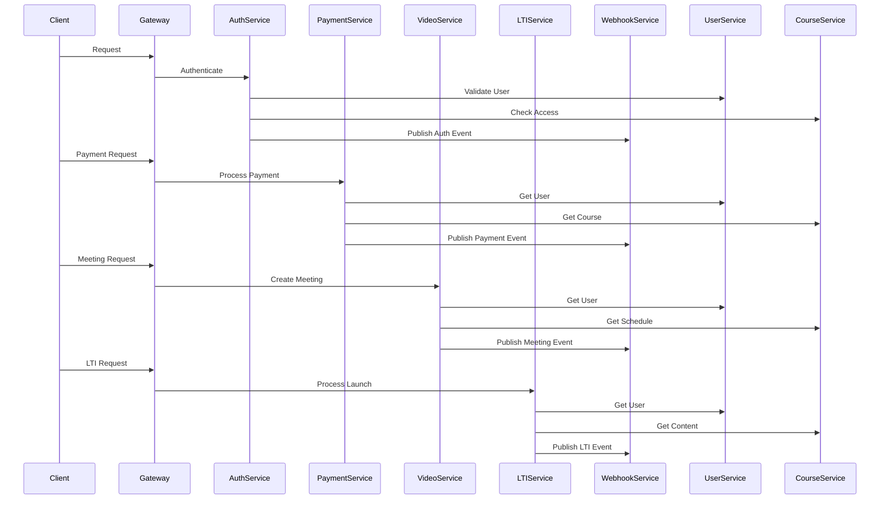

# Technical Context: Multi-Tenant LMS

## 1. Technology Stack (Proposed)

- **Frontend:**
  - **Core Framework:** Next.js 14+ (App Router)
  - **UI Library:** React
  - **Styling:** Tailwind CSS
  - **State Management:**
    - React Query for server state
    - Zustand for client state
  - **Component Library:**
    - Shadcn/ui (built on Radix UI)
    - Headless UI components
  - **Form Handling:** React Hook Form
  - **Data Fetching:** SWR or React Query
  - **Real-time:** Socket.io-client
  - **Testing:** Jest + React Testing Library
  - **Type Safety:** TypeScript
- **Backend:**
  - **Core Framework:** FastAPI (Python)
  - **API Documentation:** OpenAPI/Swagger (built into FastAPI)
  - **Data Validation:** Pydantic
  - **ORM:** SQLAlchemy
  - **Authentication:** JWT with Python-Jose
  - **Background Tasks:** Celery
  - **AI Integration:**
    - **ML Framework:** TensorFlow/PyTorch
    - **NLP:** spaCy/NLTK
    - **Vector Database:** Pinecone/Milvus
    - **Embeddings:** OpenAI API/HuggingFace
    - **AI Service Integration:** LangChain
- **Databases:**
  - **Primary Database:** PostgreSQL
    - User data and authentication
    - Organization and branch management
    - Course metadata and structure
    - Enrollment and progress tracking
    - Assessment results and grades
    - System configuration and settings
  - **Document Database:** MongoDB
    - Course content and materials
    - Rich text content
    - User-generated content
    - Discussion threads and comments
    - Custom form submissions
  - **Vector Database:** Pinecone
    - Content embeddings for semantic search
    - Similar content recommendations
    - Learning path optimization
    - AI-powered content matching
  - **Search Engine:** Elasticsearch
    - Full-text search across all content
    - Advanced filtering and faceted search
    - Analytics and reporting data
    - Log aggregation and monitoring
  - **Cache:** Redis
    - Session management
    - Real-time data caching
    - Rate limiting
    - Background job queues
    - WebSocket state management
- **Caching:** Redis or Memcached for performance optimization.
- **Message Queue:** RabbitMQ / Kafka / Redis Streams (for background job processing).
- **Object Storage:** AWS S3 / Google Cloud Storage / Azure Blob Storage (for storing course content, user uploads).
- **Search:** Elasticsearch / OpenSearch (for advanced search capabilities if needed).
- **Containerization:** Docker.
- **Orchestration:** Kubernetes (if using microservices).
- **API Gateway:** FastAPI
  - Request routing and load balancing
  - Authentication and authorization
  - Rate limiting and throttling
  - Request/response transformation
  - API documentation (OpenAPI/Swagger)
- **Microservices Communication:** gRPC
  - High-performance RPC
  - Protocol Buffers for serialization
  - Bi-directional streaming
  - Service discovery
  - Load balancing

## 2. Infrastructure & Deployment

- **Cloud Provider:** AWS / Google Cloud / Azure (Choice depends on cost, existing infrastructure, team familiarity, and required services).
- **Deployment Strategy:** CI/CD pipeline using tools like Jenkins, GitLab CI, GitHub Actions, Azure DevOps.
- **Infrastructure as Code (IaC):** Terraform or CloudFormation/ARM Templates for managing cloud resources.
- **Monitoring & Logging:** LGTM Stack with OpenTelemetry
  - **Logging:** Logstash for log aggregation and processing
  - **Metrics:** Mimir for metrics storage and querying
  - **Tracing:** Tempo for distributed tracing
  - **Visualization:** Grafana for unified observability
  - **Collection:** OpenTelemetry Collector for unified data collection

## 3. Development Setup & Tooling

- **Version Control:** Git (hosted on GitHub, GitLab, Bitbucket).
- **Project Management:** Jira / Trello / Asana.
- **IDE:** VS Code / IntelliJ IDEA / PyCharm (based on language choice).
- **API Documentation:** Swagger / OpenAPI specification.
- **Testing:**
  - Unit Testing: Jest / PyTest / JUnit / xUnit
  - Integration Testing: Frameworks appropriate to the stack.
  - End-to-End (E2E) Testing: Cypress / Playwright / Selenium.

## 4. Technical Constraints & Considerations

- **Scalability:** Architecture must support adding new tenants and users without significant performance degradation.
- **Security:** Implement standard security practices (OWASP Top 10), including input validation, output encoding, secure authentication/authorization, dependency scanning, regular security audits.
- **Data Privacy:** Adherence to GDPR, CCPA, and other relevant data protection regulations is mandatory.
- **Internationalization (i18n) & Localization (l10n):** The platform needs to support multiple languages and regional formats (dates, numbers) for global use.
- **Accessibility (a11y):** Adherence to WCAG (Web Content Accessibility Guidelines) standards.
- **Performance:** Optimize database queries, implement caching, use a CDN for static assets, and ensure efficient code.
- **Maintainability:** Write clean, well-documented, and testable code. Follow consistent coding standards.

## 5. Key Dependencies (Examples)

- Cloud Provider SDKs (e.g., AWS SDK)
- ORM: SQLAlchemy with Alembic for migrations
- Authentication: Python-Jose for JWT, Passport.js for OAuth
- Payment Gateway SDKs (if applicable)
- Video Conferencing SDKs (if applicable)
- AI/ML Dependencies:
  - TensorFlow/PyTorch for ML models
  - spaCy/NLTK for NLP tasks
  - LangChain for AI service integration
  - OpenAI API client
  - HuggingFace Transformers
  - Vector database clients (Pinecone/Milvus)

## 6. Organization and Branch Master Data Implementation

### Database Schema Design

- **Organization Table**

  ```sql
  CREATE TABLE organizations (
      id UUID PRIMARY KEY,
      name VARCHAR(255) NOT NULL,
      slug VARCHAR(100) UNIQUE NOT NULL,
      description TEXT,
      contact_email VARCHAR(255),
      contact_phone VARCHAR(50),
      address TEXT,
      logo_url VARCHAR(255),
      primary_color VARCHAR(20),
      secondary_color VARCHAR(20),
      subscription_plan VARCHAR(50),
      subscription_status VARCHAR(20),
      subscription_expiry_date TIMESTAMP,
      created_at TIMESTAMP DEFAULT CURRENT_TIMESTAMP,
      updated_at TIMESTAMP DEFAULT CURRENT_TIMESTAMP,
      is_active BOOLEAN DEFAULT TRUE,
      settings JSONB,
      api_keys JSONB
  );
  ```

- **Branch Table**

  ```sql
  CREATE TABLE branches (
      id UUID PRIMARY KEY,
      organization_id UUID NOT NULL REFERENCES organizations(id),
      name VARCHAR(255) NOT NULL,
      slug VARCHAR(100) NOT NULL,
      description TEXT,
      contact_email VARCHAR(255),
      contact_phone VARCHAR(50),
      address TEXT,
      city VARCHAR(100),
      state VARCHAR(100),
      country VARCHAR(100),
      postal_code VARCHAR(20),
      latitude DECIMAL(10, 8),
      longitude DECIMAL(11, 8),
      logo_url VARCHAR(255),
      created_at TIMESTAMP DEFAULT CURRENT_TIMESTAMP,
      updated_at TIMESTAMP DEFAULT CURRENT_TIMESTAMP,
      is_active BOOLEAN DEFAULT TRUE,
      settings JSONB,
      resource_allocation JSONB,
      UNIQUE(organization_id, slug)
  );
  ```

- **Organization Settings Table**

  ```sql
  CREATE TABLE organization_settings (
      id UUID PRIMARY KEY,
      organization_id UUID NOT NULL REFERENCES organizations(id),
      setting_key VARCHAR(100) NOT NULL,
      setting_value JSONB,
      created_at TIMESTAMP DEFAULT CURRENT_TIMESTAMP,
      updated_at TIMESTAMP DEFAULT CURRENT_TIMESTAMP,
      UNIQUE(organization_id, setting_key)
  );
  ```

- **Branch Settings Table**

    ```sql
    CREATE TABLE branch_settings (
        id UUID PRIMARY KEY,
        branch_id UUID NOT NULL REFERENCES branches(id),
        setting_key VARCHAR(100) NOT NULL,
        setting_value JSONB,
        created_at TIMESTAMP DEFAULT CURRENT_TIMESTAMP,
        updated_at TIMESTAMP DEFAULT CURRENT_TIMESTAMP,
        UNIQUE(branch_id, setting_key)
    );
    ```

### API Endpoints

- **Organization Management**

  ```code
  GET /api/organizations - List organizations
  GET /api/organizations/{id} - Get organization details
  POST /api/organizations - Create new organization
  PUT /api/organizations/{id} - Update organization
  DELETE /api/organizations/{id} - Delete organization
  GET /api/organizations/{id}/settings - Get organization settings
  PUT /api/organizations/{id}/settings - Update organization settings
  ```

- **Branch Management**

  ```code
  GET /api/organizations/{orgId}/branches - List branches
  GET /api/organizations/{orgId}/branches/{id} - Get branch details
  POST /api/organizations/{orgId}/branches - Create new branch
  PUT /api/organizations/{orgId}/branches/{id} - Update branch
  DELETE /api/organizations/{orgId}/branches/{id} - Delete branch
  GET /api/organizations/{orgId}/branches/{id}/settings - Get branch settings
  PUT /api/organizations/{orgId}/branches/{id}/settings - Update branch settings
  ```

### Caching Strategy

- **Redis Implementation**

  ```javascript
  // Cache organization data
  async function getOrganization(orgId) {
    const cacheKey = `org:${orgId}`;
    let org = await redis.get(cacheKey);

    if (!org) {
      org = await db.organizations.findById(orgId);
      await redis.set(cacheKey, JSON.stringify(org), "EX", 3600); // 1 hour expiry
    } else {
      org = JSON.parse(org);
    }

    return org;
  }

  // Cache branch data
  async function getBranch(orgId, branchId) {
    const cacheKey = `org:${orgId}:branch:${branchId}`;
    let branch = await redis.get(cacheKey);

    if (!branch) {
      branch = await db.branches.findOne({
        where: { id: branchId, organization_id: orgId },
      });
      await redis.set(cacheKey, JSON.stringify(branch), "EX", 3600); // 1 hour expiry
    } else {
      branch = JSON.parse(branch);
    }

    return branch;
  }
  ```

### Event-Driven Updates

- **Event Types**

  ```javascript
  // Organization events
  const ORGANIZATION_CREATED = "organization.created";
  const ORGANIZATION_UPDATED = "organization.updated";
  const ORGANIZATION_DELETED = "organization.deleted";
  const ORGANIZATION_SETTINGS_UPDATED = "organization.settings.updated";

  // Branch events
  const BRANCH_CREATED = "branch.created";
  const BRANCH_UPDATED = "branch.updated";
  const BRANCH_DELETED = "branch.deleted";
  const BRANCH_SETTINGS_UPDATED = "branch.settings.updated";
  ```

- **Event Publishing**

  ```javascript
  // Publish organization event
  async function publishOrganizationEvent(eventType, organization) {
    await messageQueue.publish("organization-events", {
      type: eventType,
      timestamp: new Date(),
      data: organization,
    });
  }

  // Publish branch event
  async function publishBranchEvent(eventType, organizationId, branch) {
    await messageQueue.publish("branch-events", {
      type: eventType,
      timestamp: new Date(),
      organizationId,
      data: branch,
    });
  }
  ```

### Data Validation

- **Organization Validation**

  ```javascript
  const organizationSchema = Joi.object({
    name: Joi.string().required().min(3).max(255),
    slug: Joi.string()
      .required()
      .min(3)
      .max(100)
      .pattern(/^[a-z0-9-]+$/),
    description: Joi.string().allow("").max(1000),
    contact_email: Joi.string().email().required(),
    contact_phone: Joi.string()
      .pattern(/^\+?[0-9\s-()]+$/)
      .required(),
    address: Joi.string().required(),
    logo_url: Joi.string().uri().allow(""),
    primary_color: Joi.string()
      .pattern(/^#[0-9A-Fa-f]{6}$/)
      .allow(""),
    secondary_color: Joi.string()
      .pattern(/^#[0-9A-Fa-f]{6}$/)
      .allow(""),
    subscription_plan: Joi.string()
      .valid("free", "basic", "premium", "enterprise")
      .required(),
    settings: Joi.object().unknown(true),
  });
  ```

- **Branch Validation**
  
  ```javascript
  const branchSchema = Joi.object({
    name: Joi.string().required().min(3).max(255),
    slug: Joi.string()
      .required()
      .min(3)
      .max(100)
      .pattern(/^[a-z0-9-]+$/),
    description: Joi.string().allow("").max(1000),
    contact_email: Joi.string().email().required(),
    contact_phone: Joi.string()
      .pattern(/^\+?[0-9\s-()]+$/)
      .required(),
    address: Joi.string().required(),
    city: Joi.string().required(),
    state: Joi.string().required(),
    country: Joi.string().required(),
    postal_code: Joi.string().required(),
    latitude: Joi.number().min(-90).max(90).allow(null),
    longitude: Joi.number().min(-180).max(180).allow(null),
    logo_url: Joi.string().uri().allow(""),
    settings: Joi.object().unknown(true),
  });
  ```

## 6. AI Integration Architecture

### AI Service Components

- **Content Generation & Enhancement**

  ```python
  from langchain import OpenAI, LLMChain
  from langchain.prompts import PromptTemplate

  class ContentGenerator:
      def __init__(self):
          self.llm = OpenAI()
          self.prompt = PromptTemplate(
              input_variables=["topic", "style"],
              template="Generate educational content about {topic} in {style} style"
          )
          self.chain = LLMChain(llm=self.llm, prompt=self.prompt)

      async def generate_content(self, topic: str, style: str) -> str:
          return await self.chain.arun(topic=topic, style=style)
  ```

- **Personalized Learning Paths**

  ```python
  from sklearn.cluster import KMeans
  import numpy as np

  class LearningPathOptimizer:
      def __init__(self):
          self.model = KMeans(n_clusters=5)

      async def optimize_path(self, student_data: List[Dict]) -> Dict:
          features = self._extract_features(student_data)
          clusters = self.model.fit_predict(features)
          return self._generate_paths(clusters)
  ```

- **Intelligent Assessment**

  ```python
  class AssessmentGenerator:
      def __init__(self):
          self.nlp = spacy.load("en_core_web_lg")

      async def generate_questions(self, content: str, difficulty: str) -> List[Dict]:
          doc = self.nlp(content)
          return await self._create_questions(doc, difficulty)
  ```

### AI Service Integration

- **FastAPI Integration**

  ```python
  from fastapi import FastAPI, Depends
  from .ai_services import ContentGenerator, LearningPathOptimizer, AssessmentGenerator

  app = FastAPI()

  @app.post("/api/ai/generate-content")
  async def generate_content(
      topic: str,
      style: str,
      generator: ContentGenerator = Depends()
  ):
      return await generator.generate_content(topic, style)

  @app.post("/api/ai/optimize-path")
  async def optimize_learning_path(
      student_data: List[Dict],
      optimizer: LearningPathOptimizer = Depends()
  ):
      return await optimizer.optimize_path(student_data)
  ```

- **Vector Database Integration**

  ```python
  from pinecone import Pinecone
  import numpy as np

  class VectorStore:
      def __init__(self):
          self.pc = Pinecone(api_key="your-api-key")
          self.index = self.pc.Index("lms-content")

      async def store_embedding(self, content_id: str, embedding: np.ndarray):
          await self.index.upsert([(content_id, embedding.tolist())])

      async def find_similar(self, query_embedding: np.ndarray, top_k: int = 5):
          return await self.index.query(query_embedding.tolist(), top_k=top_k)
  ```

## 7. Database Architecture

### PostgreSQL Schema Design

- **Core Tables**

  ```sql
  -- Users and Authentication
  CREATE TABLE users (
      id UUID PRIMARY KEY,
      organization_id UUID REFERENCES organizations(id),
      email VARCHAR(255) UNIQUE NOT NULL,
      password_hash VARCHAR(255) NOT NULL,
      role VARCHAR(50) NOT NULL,
      status VARCHAR(20) NOT NULL,
      profile_data JSONB,
      created_at TIMESTAMP DEFAULT CURRENT_TIMESTAMP,
      updated_at TIMESTAMP DEFAULT CURRENT_TIMESTAMP
  );

  -- Course Structure
  CREATE TABLE courses (
      id UUID PRIMARY KEY,
      organization_id UUID REFERENCES organizations(id),
      title VARCHAR(255) NOT NULL,
      slug VARCHAR(100) NOT NULL,
      description TEXT,
      status VARCHAR(20) NOT NULL,
      metadata JSONB,
      created_at TIMESTAMP DEFAULT CURRENT_TIMESTAMP,
      updated_at TIMESTAMP DEFAULT CURRENT_TIMESTAMP,
      UNIQUE(organization_id, slug)
  );

  -- Enrollments and Progress
  CREATE TABLE enrollments (
      id UUID PRIMARY KEY,
      user_id UUID REFERENCES users(id),
      course_id UUID REFERENCES courses(id),
      status VARCHAR(20) NOT NULL,
      progress JSONB,
      started_at TIMESTAMP,
      completed_at TIMESTAMP,
      created_at TIMESTAMP DEFAULT CURRENT_TIMESTAMP,
      updated_at TIMESTAMP DEFAULT CURRENT_TIMESTAMP,
      UNIQUE(user_id, course_id)
  );
  ```

### MongoDB Collections

- **Content Collections**

  ```javascript
  // Course Content
  {
      _id: ObjectId,
      courseId: UUID,
      type: String,  // 'text', 'video', 'quiz', etc.
      title: String,
      content: {
          // Flexible schema based on content type
          text: String,
          mediaUrl: String,
          questions: Array,
          // ... other content-specific fields
      },
      metadata: {
          duration: Number,
          difficulty: String,
          tags: Array,
          // ... other metadata
      },
      version: Number,
      createdAt: Date,
      updatedAt: Date
  }

  // Discussion Threads
  {
      _id: ObjectId,
      courseId: UUID,
      topicId: UUID,
      title: String,
      content: String,
      author: {
          userId: UUID,
          name: String
      },
      replies: [{
          content: String,
          author: {
              userId: UUID,
              name: String
          },
          createdAt: Date
      }],
      metadata: {
          tags: Array,
          status: String
      },
      createdAt: Date,
      updatedAt: Date
  }
  ```

### Vector Database Schema (Pinecone)

- **Content Embeddings**
  
  ```python
  # Content embedding structure
  {
      "id": "content_123",
      "values": [0.1, 0.2, ...],  # 1536-dimensional vector
      "metadata": {
          "content_type": "text",
          "course_id": "course_123",
          "title": "Introduction to Python",
          "tags": ["programming", "python", "basics"],
          "difficulty": "beginner"
      }
  }
  ```

### Elasticsearch Indices

- **Search Indices**
  
  ```json
  {
    "mappings": {
      "properties": {
        "id": { "type": "keyword" },
        "organization_id": { "type": "keyword" },
        "content_type": { "type": "keyword" },
        "title": {
          "type": "text",
          "fields": {
            "keyword": { "type": "keyword" }
          }
        },
        "content": { "type": "text" },
        "metadata": {
          "properties": {
            "tags": { "type": "keyword" },
            "difficulty": { "type": "keyword" },
            "duration": { "type": "integer" }
          }
        },
        "created_at": { "type": "date" },
        "updated_at": { "type": "date" }
      }
    }
  }
  ```

### Redis Data Structures

- **Caching Patterns**

  ```python
  # Session data
  session_key = f"session:{session_id}"
  await redis.hset(session_key, mapping={
      "user_id": user_id,
      "organization_id": org_id,
      "role": role,
      "last_active": timestamp
  })
  await redis.expire(session_key, 3600)  # 1 hour expiry

  # Course content cache
  content_key = f"course:{course_id}:content:{content_id}"
  await redis.set(content_key, content_json, ex=3600)

  # Real-time presence
  presence_key = f"presence:course:{course_id}"
  await redis.sadd(presence_key, user_id)
  await redis.expire(presence_key, 300)  # 5 minutes expiry
  ```

### Data Access Patterns

- **Multi-Database Operations**

  ```python
  class ContentService:
      def __init__(self):
          self.pg = PostgresClient()
          self.mongo = MongoClient()
          self.redis = RedisClient()
          self.es = ElasticsearchClient()
          self.pinecone = PineconeClient()

      async def create_course_content(self, content_data: dict):
          # 1. Store metadata in PostgreSQL
          course_metadata = await self.pg.insert(
              "courses",
              {
                  "title": content_data["title"],
                  "organization_id": content_data["org_id"],
                  "status": "draft"
              }
          )

          # 2. Store content in MongoDB
          content_doc = await self.mongo.course_content.insert_one({
              "courseId": course_metadata["id"],
              "type": content_data["type"],
              "content": content_data["content"],
              "metadata": content_data["metadata"]
          })

          # 3. Generate and store embeddings in Pinecone
          embedding = await self.generate_embedding(content_data["content"])
          await self.pinecone.upsert(
              vectors=[{
                  "id": str(content_doc.inserted_id),
                  "values": embedding,
                  "metadata": {
                      "course_id": course_metadata["id"],
                      "title": content_data["title"]
                  }
              }]
          )

          # 4. Index in Elasticsearch
          await self.es.index(
              index="course_content",
              document={
                  "id": str(content_doc.inserted_id),
                  "course_id": course_metadata["id"],
                  "title": content_data["title"],
                  "content": content_data["content"],
                  "metadata": content_data["metadata"]
              }
          )

          # 5. Cache in Redis
          await self.redis.set(
              f"course:{course_metadata['id']}:content:{content_doc.inserted_id}",
              json.dumps(content_data),
              ex=3600
          )

          return course_metadata["id"]
  ```

## 8. Monitoring & Observability Architecture

### OpenTelemetry Collector Configuration

- **Collector Configuration**

  ```yaml
  receivers:
    otlp:
      protocols:
        grpc:
          endpoint: 0.0.0.0:4317
        http:
          endpoint: 0.0.0.0:4318
    prometheus:
      config:
        scrape_configs:
          - job_name: "lms"
            scrape_interval: 15s
            static_configs:
              - targets: ["localhost:9090"]
    filelog:
      include: [/var/log/lms/*.log]
      operators:
        - type: json
          timestamp:
            parse_from: timestamp
            layout: "%Y-%m-%dT%H:%M:%S.%LZ"

  processors:
    batch:
      timeout: 1s
      send_batch_size: 1024
    memory_limiter:
      check_interval: 1s
      limit_mib: 1500
      spike_limit_mib: 512
    resource:
      attributes:
        - key: service.name
          value: lms
          action: insert
        - key: environment
          value: production
          action: insert

  exporters:
    logging:
      loglevel: debug
    otlp:
      endpoint: tempo:4317
      tls:
        insecure: true
    prometheus:
      endpoint: "0.0.0.0:8889"
    loki:
      endpoint: "http://loki:3100/loki/api/v1/push"
      default_labels_enabled:
        exporter: true
        job: true
        instance: true

  service:
    pipelines:
      traces:
        receivers: [otlp]
        processors: [memory_limiter, batch, resource]
        exporters: [otlp, logging]
      metrics:
        receivers: [otlp, prometheus]
        processors: [memory_limiter, batch, resource]
        exporters: [prometheus, logging]
      logs:
        receivers: [otlp, filelog]
        processors: [memory_limiter, batch, resource]
        exporters: [loki, logging]
  ```

### Application Instrumentation

- **FastAPI Instrumentation**

  ```python
  from opentelemetry import trace
  from opentelemetry.instrumentation.fastapi import FastAPIInstrumentor
  from opentelemetry.sdk.trace import TracerProvider
  from opentelemetry.sdk.trace.export import BatchSpanProcessor
  from opentelemetry.exporter.otlp.proto.grpc.trace_exporter import OTLPSpanExporter

  # Initialize tracer
  trace.set_tracer_provider(TracerProvider())
  otlp_exporter = OTLPSpanExporter(endpoint="otel-collector:4317", insecure=True)
  span_processor = BatchSpanProcessor(otlp_exporter)
  trace.get_tracer_provider().add_span_processor(span_processor)

  # Instrument FastAPI app
  FastAPIInstrumentor.instrument_app(app, tracer_provider=trace.get_tracer_provider())
  ```

- **Custom Instrumentation**

  ```python
  from opentelemetry import trace
  from opentelemetry.trace import Status, StatusCode

  tracer = trace.get_tracer(__name__)

  class ContentService:
      async def create_course_content(self, content_data: dict):
          with tracer.start_as_current_span("create_course_content") as span:
              try:
                  # Add context to span
                  span.set_attribute("content.type", content_data["type"])
                  span.set_attribute("organization.id", content_data["org_id"])

                  # Store metadata in PostgreSQL
                  with tracer.start_as_current_span("store_metadata") as db_span:
                      course_metadata = await self.pg.insert(
                          "courses",
                          {
                              "title": content_data["title"],
                              "organization_id": content_data["org_id"],
                              "status": "draft"
                          }
                      )
                      db_span.set_attribute("course.id", course_metadata["id"])

                  # Store content in MongoDB
                  with tracer.start_as_current_span("store_content") as content_span:
                      content_doc = await self.mongo.course_content.insert_one({
                          "courseId": course_metadata["id"],
                          "type": content_data["type"],
                          "content": content_data["content"],
                          "metadata": content_data["metadata"]
                      })
                      content_span.set_attribute("content.id", str(content_doc.inserted_id))

                  span.set_status(Status(StatusCode.OK))
                  return course_metadata["id"]

              except Exception as e:
                  span.set_status(Status(StatusCode.ERROR, str(e)))
                  raise
  ```

### Logging Configuration

- **Logstash Pipeline**

  ```conf
  input {
    beats {
      port => 5044
    }
  }

  filter {
    if [type] == "lms" {
      json {
        source => "message"
      }

      date {
        match => [ "timestamp", "ISO8601" ]
        target => "@timestamp"
      }

      mutate {
        add_field => {
          "environment" => "%{[metadata][environment]}"
          "service" => "%{[metadata][service]}"
        }
      }
    }
  }

  output {
    elasticsearch {
      hosts => ["elasticsearch:9200"]
      index => "lms-logs-%{+YYYY.MM.dd}"
    }
  }
  ```

### Metrics Collection

- **Custom Metrics**

  ```python
  from opentelemetry import metrics
  from opentelemetry.sdk.metrics import MeterProvider
  from opentelemetry.exporter.prometheus import PrometheusMetricReader
  from opentelemetry.sdk.resources import Resource
  from opentelemetry.semconv.resource import ResourceAttributes

  # Initialize metrics
  resource = Resource.create({
      ResourceAttributes.SERVICE_NAME: "lms",
      ResourceAttributes.SERVICE_VERSION: "1.0.0",
  })
  reader = PrometheusMetricReader()
  metrics.set_meter_provider(MeterProvider(resource=resource, metric_readers=[reader]))
  meter = metrics.get_meter(__name__)

  # Define metrics
  active_users = meter.create_up_down_counter(
      "lms.active_users",
      description="Number of active users",
      unit="1"
  )

  course_completion_rate = meter.create_histogram(
      "lms.course_completion_rate",
      description="Course completion rate",
      unit="1"
  )

  api_latency = meter.create_histogram(
      "lms.api_latency",
      description="API endpoint latency",
      unit="ms"
  )
  ```

### Grafana Dashboards

- **Dashboard Configuration**
  
  ```json
  {
    "dashboard": {
      "id": null,
      "title": "LMS Overview",
      "tags": ["lms", "education"],
      "timezone": "browser",
      "panels": [
        {
          "title": "Active Users",
          "type": "graph",
          "datasource": "Prometheus",
          "targets": [
            {
              "expr": "lms_active_users",
              "legendFormat": "{{organization}}"
            }
          ]
        },
        {
          "title": "Course Completion Rate",
          "type": "gauge",
          "datasource": "Prometheus",
          "targets": [
            {
              "expr": "rate(lms_course_completion_rate[5m])",
              "legendFormat": "Completion Rate"
            }
          ]
        },
        {
          "title": "API Latency",
          "type": "heatmap",
          "datasource": "Prometheus",
          "targets": [
            {
              "expr": "rate(lms_api_latency_bucket[5m])",
              "format": "heatmap",
              "legendFormat": "{{le}}"
            }
          ]
        }
      ]
    }
  }
  ```

### Alert Rules

- **Prometheus Alert Rules**

  ```yaml
  groups:
    - name: lms
      rules:
        - alert: HighErrorRate
          expr: rate(http_requests_total{status=~"5.."}[5m]) > 0.1
          for: 5m
          labels:
            severity: critical
          annotations:
            summary: High error rate detected
            description: Error rate is above 10% for the last 5 minutes

        - alert: SlowAPIResponse
          expr: histogram_quantile(0.95, rate(lms_api_latency_bucket[5m])) > 1000
          for: 5m
          labels:
            severity: warning
          annotations:
            summary: Slow API response time
            description: 95th percentile of API response time is above 1 second

        - alert: LowCourseCompletion
          expr: rate(lms_course_completion_rate[24h]) < 0.5
          for: 1h
          labels:
            severity: warning
          annotations:
            summary: Low course completion rate
            description: Course completion rate is below 50% for the last 24 hours
  ```

## 9. Security Architecture

### Authentication & Authorization

- **JWT Implementation**

  ```python
  from datetime import datetime, timedelta
  from jose import JWTError, jwt
  from passlib.context import CryptContext
  from fastapi import Depends, HTTPException, status
  from fastapi.security import OAuth2PasswordBearer

  # Security configuration
  SECRET_KEY = "your-secret-key"  # Store in environment variables
  ALGORITHM = "HS256"
  ACCESS_TOKEN_EXPIRE_MINUTES = 30
  REFRESH_TOKEN_EXPIRE_DAYS = 7

  pwd_context = CryptContext(schemes=["bcrypt"], deprecated="auto")
  oauth2_scheme = OAuth2PasswordBearer(tokenUrl="token")

  class SecurityService:
      def verify_password(self, plain_password: str, hashed_password: str) -> bool:
          return pwd_context.verify(plain_password, hashed_password)

      def get_password_hash(self, password: str) -> str:
          return pwd_context.hash(password)

      def create_access_token(self, data: dict, expires_delta: timedelta = None) -> str:
          to_encode = data.copy()
          if expires_delta:
              expire = datetime.utcnow() + expires_delta
          else:
              expire = datetime.utcnow() + timedelta(minutes=15)
          to_encode.update({"exp": expire})
          encoded_jwt = jwt.encode(to_encode, SECRET_KEY, algorithm=ALGORITHM)
          return encoded_jwt

      async def get_current_user(self, token: str = Depends(oauth2_scheme)):
          credentials_exception = HTTPException(
              status_code=status.HTTP_401_UNAUTHORIZED,
              detail="Could not validate credentials",
              headers={"WWW-Authenticate": "Bearer"},
          )
          try:
              payload = jwt.decode(token, SECRET_KEY, algorithms=[ALGORITHM])
              username: str = payload.get("sub")
              if username is None:
                  raise credentials_exception
          except JWTError:
              raise credentials_exception
          return username
  ```

### Role-Based Access Control (RBAC)

- **Permission System**

  ```python
  from enum import Enum
  from typing import List, Set
  from fastapi import HTTPException, status

  class Permission(str, Enum):
      READ_COURSE = "read:course"
      WRITE_COURSE = "write:course"
      DELETE_COURSE = "delete:course"
      MANAGE_USERS = "manage:users"
      MANAGE_ORGANIZATION = "manage:organization"
      VIEW_ANALYTICS = "view:analytics"

  class Role(str, Enum):
      STUDENT = "student"
      TEACHER = "teacher"
      ADMIN = "admin"
      SUPER_ADMIN = "super_admin"

  class RBACService:
      def __init__(self):
          self.role_permissions = {
              Role.STUDENT: {
                  Permission.READ_COURSE,
                  Permission.VIEW_ANALYTICS
              },
              Role.TEACHER: {
                  Permission.READ_COURSE,
                  Permission.WRITE_COURSE,
                  Permission.VIEW_ANALYTICS
              },
              Role.ADMIN: {
                  Permission.READ_COURSE,
                  Permission.WRITE_COURSE,
                  Permission.DELETE_COURSE,
                  Permission.MANAGE_USERS,
                  Permission.VIEW_ANALYTICS
              },
              Role.SUPER_ADMIN: {
                  Permission.READ_COURSE,
                  Permission.WRITE_COURSE,
                  Permission.DELETE_COURSE,
                  Permission.MANAGE_USERS,
                  Permission.MANAGE_ORGANIZATION,
                  Permission.VIEW_ANALYTICS
              }
          }

      def check_permission(self, user_role: Role, required_permission: Permission) -> bool:
          return required_permission in self.role_permissions.get(user_role, set())

      async def verify_permission(self, user_role: Role, required_permission: Permission):
          if not self.check_permission(user_role, required_permission):
              raise HTTPException(
                  status_code=status.HTTP_403_FORBIDDEN,
                  detail="Not enough permissions"
              )
  ```

### Data Encryption

- **Encryption Service**

  ```python
  from cryptography.fernet import Fernet
  from cryptography.hazmat.primitives import hashes
  from cryptography.hazmat.primitives.kdf.pbkdf2 import PBKDF2HMAC
  import base64
  import os

  class EncryptionService:
      def __init__(self):
          self.salt = os.urandom(16)
          self.key = self._generate_key()
          self.cipher_suite = Fernet(self.key)

      def _generate_key(self) -> bytes:
          kdf = PBKDF2HMAC(
              algorithm=hashes.SHA256(),
              length=32,
              salt=self.salt,
              iterations=100000,
          )
          key = base64.urlsafe_b64encode(kdf.derive(os.environ["ENCRYPTION_KEY"].encode()))
          return key

      def encrypt_data(self, data: str) -> str:
          return self.cipher_suite.encrypt(data.encode()).decode()

      def decrypt_data(self, encrypted_data: str) -> str:
          return self.cipher_suite.decrypt(encrypted_data.encode()).decode()
  ```

### API Security

- **Rate Limiting**

  ```python
  from fastapi import Request
  from redis import Redis
  import time

  class RateLimiter:
      def __init__(self, redis_client: Redis):
          self.redis = redis_client
          self.rate_limit = 100  # requests per minute
          self.window = 60  # seconds

      async def check_rate_limit(self, request: Request):
          client_ip = request.client.host
          key = f"rate_limit:{client_ip}"

          current = self.redis.get(key)
          if current is None:
              self.redis.setex(key, self.window, 1)
          elif int(current) >= self.rate_limit:
              raise HTTPException(
                  status_code=status.HTTP_429_TOO_MANY_REQUESTS,
                  detail="Rate limit exceeded"
              )
          else:
              self.redis.incr(key)
  ```

### Security Headers

- **Middleware Configuration**

  ```python
  from fastapi import FastAPI
  from starlette.middleware.cors import CORSMiddleware
  from starlette.middleware.sessions import SessionMiddleware
  from starlette.middleware.trustedhost import TrustedHostMiddleware

  def configure_security_middleware(app: FastAPI):
      # CORS configuration
      app.add_middleware(
          CORSMiddleware,
          allow_origins=["https://yourdomain.com"],
          allow_credentials=True,
          allow_methods=["*"],
          allow_headers=["*"],
      )

      # Security headers
      @app.middleware("http")
      async def add_security_headers(request, call_next):
          response = await call_next(request)
          response.headers["X-Content-Type-Options"] = "nosniff"
          response.headers["X-Frame-Options"] = "DENY"
          response.headers["X-XSS-Protection"] = "1; mode=block"
          response.headers["Strict-Transport-Security"] = "max-age=31536000; includeSubDomains"
          response.headers["Content-Security-Policy"] = "default-src 'self'"
          return response

      # Trusted hosts
      app.add_middleware(
          TrustedHostMiddleware,
          allowed_hosts=["yourdomain.com", "*.yourdomain.com"]
      )
  ```

### Audit Logging

- **Audit Service**

  ```python
  from datetime import datetime
  from typing import Any, Dict
  import json

  class AuditService:
      def __init__(self, logger):
          self.logger = logger

      async def log_audit_event(
          self,
          user_id: str,
          action: str,
          resource_type: str,
          resource_id: str,
          details: Dict[str, Any] = None
      ):
          audit_event = {
              "timestamp": datetime.utcnow().isoformat(),
              "user_id": user_id,
              "action": action,
              "resource_type": resource_type,
              "resource_id": resource_id,
              "details": details or {},
              "ip_address": "client_ip",  # Get from request context
              "user_agent": "user_agent"  # Get from request context
          }

          self.logger.info(
              "Audit Event",
              extra={"audit_event": json.dumps(audit_event)}
          )
  ```

### Security Monitoring

- **Security Event Monitoring**

  ```python
  from opentelemetry import trace
  from opentelemetry.trace import Status, StatusCode

  class SecurityMonitor:
      def __init__(self):
          self.tracer = trace.get_tracer(__name__)

      async def monitor_security_event(self, event_type: str, details: dict):
          with self.tracer.start_as_current_span("security_event") as span:
              span.set_attribute("event.type", event_type)
              span.set_attribute("event.details", str(details))

              # Add security-specific attributes
              if "ip_address" in details:
                  span.set_attribute("security.ip_address", details["ip_address"])
              if "user_id" in details:
                  span.set_attribute("security.user_id", details["user_id"])

              # Log security event
              self.logger.warning(
                  f"Security Event: {event_type}",
                  extra={"security_event": details}
              )
  ```

### Security Best Practices

1. **Password Policies**

   - Minimum length: 12 characters
   - Require uppercase, lowercase, numbers, and special characters
   - Password history: Last 5 passwords
   - Maximum age: 90 days
   - Account lockout after 5 failed attempts

2. **Session Management**

   - Session timeout: 30 minutes
   - Refresh token rotation
   - Concurrent session limits
   - Session invalidation on password change

3. **Data Protection**

   - Encryption at rest for sensitive data
   - TLS 1.3 for all communications
   - Regular security audits
   - Automated vulnerability scanning

4. **Access Control**

   - Principle of least privilege
   - Role-based access control
   - Resource-level permissions
   - Regular access reviews

5. **Security Monitoring**
   - Real-time security event monitoring
   - Automated threat detection
   - Regular security assessments
   - Incident response procedures

## 10. Microservices Architecture

### Microservices Breakdown

- **User Service (Port: 50051)**

  - **Responsibilities:**
    - User management and authentication
    - Role-based access control
    - User profile management
    - Organization membership
    - User preferences and settings
  - **Key Features:**
    - JWT token generation and validation
    - Password hashing and verification
    - User session management
    - Multi-factor authentication
    - User activity tracking
  - **Data Storage:**
    - PostgreSQL for user data
    - Redis for session management
    - MongoDB for user preferences

- **Course Service (Port: 50052)**

  - **Responsibilities:**
    - Course creation and management
    - Course enrollment
    - Course scheduling
    - Prerequisites management
    - Course versioning
  - **Key Features:**
    - Course template management
    - Batch course creation
    - Course duplication
    - Course archiving
    - Course analytics
  - **Data Storage:**
    - PostgreSQL for course metadata
    - MongoDB for course content
    - Redis for course caching

- **Content Service (Port: 50053)**

  - **Responsibilities:**
    - Learning content management
    - Content versioning
    - Media asset management
    - Content delivery
    - Content search and indexing
  - **Key Features:**
    - Content type support (text, video, audio, quiz)
    - Content scheduling
    - Content preview
    - Content analytics
    - Content recommendations
  - **Data Storage:**
    - MongoDB for content storage
    - Elasticsearch for content search
    - S3 for media storage
    - Redis for content caching

- **Analytics Service (Port: 50054)**

  - **Responsibilities:**
    - Learning analytics
    - Performance tracking
    - Usage statistics
    - Reporting
    - Data visualization
  - **Key Features:**
    - Real-time analytics
    - Custom report generation
    - Data export
    - Predictive analytics
    - Dashboard management
  - **Data Storage:**
    - ClickHouse for analytics data
    - PostgreSQL for report metadata
    - Redis for real-time metrics

- **Assessment Service (Port: 50055)**

  - **Responsibilities:**
    - Quiz and test management
    - Assignment handling
    - Grading and scoring
    - Progress tracking
    - Performance evaluation
  - **Key Features:**
    - Multiple question types
    - Auto-grading
    - Peer review
    - Plagiarism detection
    - Result analytics
  - **Data Storage:**
    - PostgreSQL for assessment metadata
    - MongoDB for assessment content
    - Redis for real-time scoring

- **Notification Service (Port: 50056)**

  - **Responsibilities:**
    - Email notifications
    - Push notifications
    - In-app notifications
    - Notification templates
    - Notification preferences
  - **Key Features:**
    - Multi-channel support
    - Template management
    - Notification scheduling
    - Delivery tracking
    - Notification analytics
  - **Data Storage:**
    - PostgreSQL for notification metadata
    - Redis for notification queue
    - MongoDB for notification history

- **Integration Service (Port: 50057)**

  - **Responsibilities:**
    - Third-party integrations
    - API management
    - Webhook handling
    - Data synchronization
    - Integration monitoring
  - **Key Features:**
    - OAuth2 integration
    - SSO support
    - Payment gateway integration
    - Video conferencing integration
    - LTI integration
  - **Data Storage:**
    - PostgreSQL for integration metadata
    - Redis for integration tokens
    - MongoDB for integration logs

- **Search Service (Port: 50058)**
  - **Responsibilities:**
    - Full-text search
    - Content indexing
    - Search suggestions
    - Search analytics
    - Search optimization
  - **Key Features:**
    - Multi-field search
    - Faceted search
    - Search highlighting
    - Search ranking
    - Search filters
  - **Data Storage:**
    - Elasticsearch for search indices
    - Redis for search caching
    - MongoDB for search suggestions

### Integration Services

- **Authentication Service (Port: 50061)**

  - **Responsibilities:**
    - OAuth2 authentication
    - SSO integration
    - Token management
    - Identity provider integration
  - **Key Features:**
    - OAuth2 provider configuration
    - SSO provider configuration
    - Token validation and refresh
    - User identity mapping
  - **Data Storage:**
    - PostgreSQL for provider configurations
    - Redis for token caching
    - MongoDB for identity mappings

- **Payment Service (Port: 50062)**

  - **Responsibilities:**
    - Payment processing
    - Refund management
    - Payment gateway integration
    - Transaction tracking
  - **Key Features:**
    - Multiple payment gateway support
    - Payment intent creation
    - Refund processing
    - Payment analytics
  - **Data Storage:**
    - PostgreSQL for payment records
    - Redis for payment caching
    - MongoDB for payment analytics

- **Video Conferencing Service (Port: 50063)**

  - **Responsibilities:**
    - Meeting management
    - Video provider integration
    - Meeting scheduling
    - Recording management
  - **Key Features:**
    - Multiple provider support (Zoom, Teams, Meet)
    - Meeting creation and management
    - Recording storage
    - Meeting analytics
  - **Data Storage:**
    - PostgreSQL for meeting metadata
    - Redis for meeting state
    - S3 for recordings

- **LTI Service (Port: 50064)**

  - **Responsibilities:**
    - LTI platform integration
    - Tool registration
    - Launch request handling
    - Grade passback
  - **Key Features:**
    - LTI 1.1 and 1.3 support
    - Tool registration
    - Launch request validation
    - Grade synchronization
  - **Data Storage:**
    - PostgreSQL for LTI configurations
    - Redis for launch state
    - MongoDB for grade records

- **Webhook Service (Port: 50065)**
  - **Responsibilities:**
    - Webhook management
    - Event distribution
    - Webhook security
    - Delivery tracking
  - **Key Features:**
    - Webhook registration
    - Event filtering
    - Signature verification
    - Delivery retry
  - **Data Storage:**
    - PostgreSQL for webhook configurations
    - Redis for event queue
    - MongoDB for delivery logs

### Service Communication



### Service Dependencies

- **Authentication Service**

  - Depends on User Service for user data
  - Depends on Course Service for course access
  - Publishes events to Webhook Service

- **Payment Service**

  - Depends on User Service for user data
  - Depends on Course Service for course pricing
  - Publishes events to Webhook Service

- **Video Conferencing Service**

  - Depends on User Service for user data
  - Depends on Course Service for course scheduling
  - Publishes events to Webhook Service

- **LTI Service**

  - Depends on User Service for user data
  - Depends on Course Service for course content
  - Publishes events to Webhook Service

- **Webhook Service**
  - No direct service dependencies
  - Consumes events from all services
  - Manages event distribution

### Event Flow



### Service Configuration

- **Authentication Service**

  ```yaml
  service:
    name: authentication-service
    port: 50061
    dependencies:
      - user-service
      - course-service
      - webhook-service
    config:
      oauth:
        providers:
          - google
          - microsoft
          - github
      sso:
        providers:
          - saml
          - oidc
  ```

- **Payment Service**

  ```yaml
  service:
    name: payment-service
    port: 50062
    dependencies:
      - user-service
      - course-service
      - webhook-service
    config:
      providers:
        - stripe
        - paypal
        - razorpay
  ```

- **Video Conferencing Service**

  ```yaml
  service:
    name: video-service
    port: 50063
    dependencies:
      - user-service
      - course-service
      - webhook-service
    config:
      providers:
        - zoom
        - teams
        - meet
  ```

- **LTI Service**

  ```yaml
  service:
    name: lti-service
    port: 50064
    dependencies:
      - user-service
      - course-service
      - webhook-service
    config:
      versions:
        - 1.1
        - 1.3
      features:
        - grade_passback
        - deep_linking
  ```

- **Webhook Service**
  
  ```yaml
  service:
    name: webhook-service
    port: 50065
    config:
      retry:
        max_attempts: 3
        initial_delay: 1s
        max_delay: 30s
      security:
        signature_algorithm: hmac-sha256
        token_expiry: 24h
  ```

## Badge and Certificate System

### Architecture Overview

The badge and certificate system is implemented using a multi-layer architecture:

1. **Data Layer**

   - PostgreSQL for badge definitions and certificates
   - MongoDB for badge progress and certificate data
   - Redis for caching and real-time updates

2. **Service Layer**

   - Badge Management Service
   - Certificate Generation Service
   - Verification Service
   - Social Media Integration Service

3. **API Layer**
   - RESTful endpoints for badge and certificate management
   - GraphQL API for flexible data querying
   - WebSocket for real-time progress updates

### Badge System Implementation

```python
# Badge Definition Service
class BadgeDefinitionService:
    def create_badge(self, organization_id: UUID, data: dict) -> BadgeDefinition:
        # Create badge definition with criteria
        pass

    def update_badge(self, badge_id: UUID, data: dict) -> BadgeDefinition:
        # Update badge definition and criteria
        pass

    def check_criteria(self, user_id: UUID, badge_id: UUID) -> bool:
        # Check if user meets badge criteria
        pass

# Badge Progress Service
class BadgeProgressService:
    def track_progress(self, user_id: UUID, badge_id: UUID, criteria: str) -> float:
        # Track progress towards badge completion
        pass

    def award_badge(self, user_id: UUID, badge_id: UUID) -> EarnedBadge:
        # Award badge to user
        pass

    def get_user_badges(self, user_id: UUID) -> List[EarnedBadge]:
        # Get all badges earned by user
        pass
```

### Certificate System Implementation

```python
# Certificate Template Service
class CertificateTemplateService:
    def create_template(self, organization_id: UUID, data: dict) -> CertificateTemplate:
        # Create certificate template
        pass

    def update_template(self, template_id: UUID, data: dict) -> CertificateTemplate:
        # Update certificate template
        pass

# Certificate Generation Service
class CertificateGenerationService:
    def generate_certificate(self, user_id: UUID, course_id: UUID, template_id: UUID) -> str:
        # Generate certificate PDF
        pass

    def verify_certificate(self, verification_code: str) -> dict:
        # Verify certificate authenticity
        pass

# Social Media Integration Service
class SocialMediaService:
    def share_badge(self, user_id: UUID, badge_id: UUID, platform: str) -> str:
        # Share badge on social media
        pass

    def share_certificate(self, user_id: UUID, certificate_id: UUID, platform: str) -> str:
        # Share certificate on social media
        pass
```

### API Endpoints

```python
# Badge Endpoints
@router.post("/badges")
async def create_badge(
    badge: BadgeCreate,
    current_user: User = Depends(get_current_user)
) -> BadgeDefinition:
    # Create new badge definition
    pass

@router.get("/badges/{badge_id}/progress")
async def get_badge_progress(
    badge_id: UUID,
    current_user: User = Depends(get_current_user)
) -> BadgeProgress:
    # Get badge progress
    pass

# Certificate Endpoints
@router.post("/certificates/generate")
async def generate_certificate(
    data: CertificateGenerate,
    current_user: User = Depends(get_current_user)
) -> str:
    # Generate certificate
    pass

@router.get("/certificates/verify/{code}")
async def verify_certificate(
    code: str
) -> CertificateVerification:
    # Verify certificate
    pass
```

### Caching Strategy

```python
# Redis Cache Keys
BADGE_PROGRESS_KEY = "badge_progress:{user_id}:{badge_id}"
CERTIFICATE_CACHE_KEY = "certificate:{certificate_id}"
VERIFICATION_CACHE_KEY = "verification:{code}"

# Cache TTL (Time To Live)
BADGE_PROGRESS_TTL = 3600  # 1 hour
CERTIFICATE_CACHE_TTL = 86400  # 24 hours
VERIFICATION_CACHE_TTL = 604800  # 1 week
```

### Security Measures

1. **Certificate Verification**

   - Unique verification codes
   - Blockchain-based verification (optional)
   - Public verification endpoints

2. **Badge Progress Protection**

   - Server-side progress validation
   - Anti-cheating measures
   - Progress audit logging

3. **Social Media Integration**
   - OAuth2 authentication
   - Secure token storage
   - Rate limiting

### Performance Optimization

1. **Caching Strategy**

   - Redis for badge progress
   - CDN for certificate storage
   - In-memory caching for templates

2. **Batch Processing**

   - Bulk certificate generation
   - Batch badge awards
   - Scheduled progress updates

3. **Resource Management**
   - Image optimization for badges
   - PDF compression for certificates
   - CDN distribution

## API Implementation

### API Endpoints

#### Authentication & Authorization

```python
# FastAPI implementation example
@router.post("/auth/login")
async def login(credentials: LoginCredentials):
    # Implementation
    pass

@router.post("/auth/register")
async def register(user: UserCreate):
    # Implementation
    pass
```

#### Organization Management

```python
@router.get("/organizations")
async def list_organizations(
    skip: int = 0,
    limit: int = 10,
    current_user: User = Depends(get_current_user)
):
    # Implementation
    pass

@router.post("/organizations")
async def create_organization(
    org: OrganizationCreate,
    current_user: User = Depends(get_current_user)
):
    # Implementation
    pass
```

### API Response Format

```python
# Response model
class APIResponse(BaseModel):
    success: bool
    data: Optional[Any]
    meta: Optional[MetaData]
    error: Optional[ErrorData]

# Error model
class ErrorData(BaseModel):
    code: str
    message: str
    details: Optional[Dict[str, Any]]
```

### Rate Limiting Implementation

```python
# Redis-based rate limiter
class RateLimiter:
    def __init__(self, redis_client: Redis):
        self.redis = redis_client

    async def check_rate_limit(
        self,
        key: str,
        limit: int,
        window: int
    ) -> bool:
        # Implementation
        pass
```

### Authentication Implementation

```python
# JWT authentication
class JWTAuth:
    def __init__(self, secret_key: str):
        self.secret_key = secret_key

    def create_token(self, data: dict) -> str:
        # Implementation
        pass

    def verify_token(self, token: str) -> dict:
        # Implementation
        pass
```

### Pagination Implementation

```python
# Pagination helper
class Pagination:
    def __init__(
        self,
        page: int = 1,
        per_page: int = 10,
        max_per_page: int = 100
    ):
        self.page = max(1, page)
        self.per_page = min(per_page, max_per_page)
        self.skip = (self.page - 1) * self.per_page
```

### Filtering Implementation

```python
# Filter parser
class FilterParser:
    def parse_filter(self, filter_str: str) -> Dict[str, Any]:
        # Implementation
        pass

    def apply_filters(
        self,
        query: Query,
        filters: Dict[str, Any]
    ) -> Query:
        # Implementation
        pass
```

### API Documentation

```python
# OpenAPI configuration
app = FastAPI(
    title="LMS API",
    description="Learning Management System API",
    version="1.0.0",
    docs_url="/api/docs",
    redoc_url="/api/redoc",
    openapi_url="/api/openapi.json"
)
```

### Error Handling

```python
# Global error handler
@app.exception_handler(Exception)
async def global_exception_handler(request: Request, exc: Exception):
    # Implementation
    pass

# Custom exceptions
class APIError(Exception):
    def __init__(
        self,
        code: str,
        message: str,
        status_code: int = 400,
        details: Optional[Dict[str, Any]] = None
    ):
        # Implementation
        pass
```

### Security Headers

```python
# Security middleware
@app.middleware("http")
async def add_security_headers(request: Request, call_next):
    response = await call_next(request)
    response.headers["X-Content-Type-Options"] = "nosniff"
    response.headers["X-Frame-Options"] = "DENY"
    response.headers["X-XSS-Protection"] = "1; mode=block"
    response.headers["Strict-Transport-Security"] = "max-age=31536000; includeSubDomains"
    return response
```

### API Testing

```python
# Test client setup
from fastapi.testclient import TestClient

client = TestClient(app)

# Example test
def test_create_organization():
    response = client.post(
        "/api/v1/organizations",
        json={
            "name": "Test Org",
            "description": "Test Description"
        }
    )
    assert response.status_code == 201
    assert response.json()["success"] is True
```

### API Monitoring

```python
# OpenTelemetry integration
from opentelemetry import trace
from opentelemetry.trace import Status, StatusCode

@app.middleware("http")
async def trace_requests(request: Request, call_next):
    with trace.get_tracer(__name__).start_as_current_span(
        "http_request",
        kind=trace.SpanKind.SERVER
    ) as span:
        # Implementation
        pass
```

## 8. Client Platforms and BFF (Backend For Frontend)

### BFF Architecture

- **BFF Pattern Overview:**

  - Dedicated backend services tailored for specific frontend clients
  - Optimized data aggregation and transformation
  - Client-specific security and performance considerations
  - Simplified API contracts for each client platform

- **BFF Implementation Strategy:**

  - **API Gateway Layer:**

    - Common authentication and authorization
    - Request routing to appropriate BFF services
    - Common rate limiting and monitoring
    - Caching strategies

  - **Mobile BFF Service:**

    - Optimized payloads for mobile bandwidth constraints
    - Mobile-specific aggregated endpoints
    - Push notification integration
    - Offline synchronization support

  - **Web BFF Service:**

    - Browser-optimized response structures
    - Web-specific session management
    - Progressive Web App (PWA) support
    - Rich UI data requirements

  - **Desktop BFF Service:**
    - Desktop-specific features and optimizations
    - Native integration capabilities
    - Platform-specific authentication flows
    - Local resource access and integration

- **BFF Security Considerations:**

  - Platform-specific authentication flows
  - Client-specific rate limiting
  - Tailored permission scopes
  - Device-specific security features

- **BFF Development Workflow:**
  - Client team and BFF team collaboration model
  - Coordinated versioning strategy
  - Shared contract testing
  - Feature toggling for platform-specific capabilities

### Mobile Platform Support

- **Android Application:**

  - **Technology Stack:**

    - Primary Language: Kotlin
    - Architecture: MVVM + Clean Architecture
    - UI Framework: Jetpack Compose
    - Networking: Retrofit + OkHttp
    - Dependency Injection: Hilt
    - State Management: Kotlin Flow + StateFlow
    - Local Storage: Room Database
    - Navigation: Navigation Component
    - Testing: JUnit, Espresso, Mockito

  - **Key Features:**

    - Offline mode with data synchronization
    - Push notifications via Firebase Cloud Messaging
    - Biometric authentication
    - Material Design 3 with dynamic theming
    - Deep linking support
    - File/media access for course materials
    - Screen sharing for virtual classroom
    - Background downloads for offline content

  - **Platform-Specific Considerations:**
    - Android version compatibility (API level 24+)
    - Device fragmentation handling
    - Permission model compliance
    - Battery optimization
    - Data usage optimization
    - Google Play Store requirements

- **iOS Application:**

  - **Technology Stack:**

    - Primary Language: Swift
    - Architecture: MVVM + Clean Architecture
    - UI Framework: SwiftUI + UIKit
    - Networking: URLSession + Combine
    - Dependency Injection: Swift Dependency Injection
    - State Management: Combine
    - Local Storage: Core Data
    - Navigation: SwiftUI Navigation / Coordinator Pattern
    - Testing: XCTest

  - **Key Features:**

    - Offline mode with data synchronization
    - Push notifications via APNS
    - Face ID / Touch ID authentication
    - Dynamic type and accessibility
    - Universal links
    - iCloud integration for backup
    - AirPlay support for presentations
    - Siri shortcuts integration

  - **Platform-Specific Considerations:**
    - iOS version support (iOS 15+)
    - iPad optimization
    - Apple App Store guidelines
    - Privacy requirements (App Privacy Report)
    - Device-specific optimizations
    - Apple Silicon support

### Desktop Platform Support

- **Windows Application:**

  - **Technology Stack:**

    - Primary Framework: Electron
    - Frontend: React + TypeScript
    - State Management: Redux + Redux Toolkit
    - UI Framework: Material-UI
    - Packaging: Electron Forge
    - IPC Communication: Electron IPC
    - File System Access: Node.js fs module
    - Updates: electron-updater
    - Testing: Jest, React Testing Library

  - **Key Features:**

    - Offline content access
    - Windows-native notifications
    - File system integration for course materials
    - Auto-updates
    - Multiple window support
    - Deep OS integration
    - Hardware acceleration for media playback
    - Custom protocol handling

  - **Platform-Specific Considerations:**
    - Windows 10/11 compatibility
    - Windows Store distribution options
    - Traditional installer (MSI) support
    - Memory management optimizations
    - Security and permissions model
    - High DPI display support
    - Touchscreen support

- **macOS Application:**

  - **Technology Stack:**

    - Primary Framework: Electron
    - Frontend: React + TypeScript
    - State Management: Redux + Redux Toolkit
    - UI Framework: Material-UI
    - Packaging: Electron Forge
    - IPC Communication: Electron IPC
    - File System Access: Node.js fs module
    - Updates: electron-updater
    - Testing: Jest, React Testing Library

  - **Key Features:**

    - Offline content access
    - macOS notifications
    - Touch Bar support
    - iCloud integration
    - Spotlight search integration
    - Apple Silicon optimization
    - Handoff support with iOS app
    - Auto-updates

  - **Platform-Specific Considerations:**
    - macOS version compatibility (10.15+)
    - Notarization requirements
    - Mac App Store guidelines (if applicable)
    - Sandboxing restrictions
    - Apple Silicon and Intel support
    - Accessibility compliance
    - System permissions model

### Cross-Platform Considerations

- **Shared Code Strategy:**

  - Core business logic in shared libraries
  - Platform-specific UI implementations
  - Unified authentication flow
  - Consistent data models
  - Shared API client libraries
  - Cross-platform testing strategy

- **Authentication & Security:**

  - Unified identity management
  - Platform-specific secure storage
  - Biometric integration
  - Device trust level evaluation
  - Cross-device session management
  - Platform-specific security certifications

- **Synchronization:**

  - Offline-first data architecture
  - Conflict resolution strategy
  - Background sync optimization
  - Platform-specific sync triggers
  - Bandwidth-aware synchronization
  - Progress tracking across devices

- **User Experience:**
  - Platform-specific design patterns
  - Consistent branding
  - Accessibility standards
  - Platform performance optimization
  - Device capability adaptation
  - Cross-platform feature parity goals
