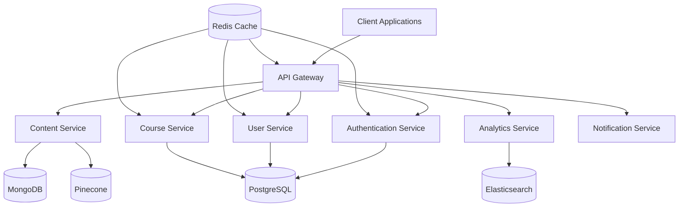

# LMS Architecture Overview

## System Architecture

The Learning Management System (LMS) follows a modern, scalable architecture designed to support multi-tenancy, high performance, and extensibility.

### High-Level Architecture

### Key Components

1. **Client Layer**

   - Next.js frontend application
   - Progressive Web App capabilities
   - Responsive design
   - Offline support

2. **API Gateway**

   - Request routing
   - Load balancing
   - Rate limiting
   - Request/response transformation
   - API documentation (OpenAPI/Swagger)

3. **Microservices**

   - Authentication Service
   - User Service
   - Course Service
   - Content Service
   - Analytics Service
   - Notification Service

4. **Data Layer**

   - PostgreSQL (Primary database)
   - MongoDB (Content storage)
   - Pinecone (Vector database)
   - Elasticsearch (Search engine)
   - Redis (Caching)

5. **Infrastructure**
   - Docker containers
   - Kubernetes orchestration
   - LGTM Stack monitoring
   - CI/CD pipeline

## Multi-Tenant Architecture

The system implements a hybrid multi-tenant architecture:

1. **Database Level**

   - Schema-based isolation
   - Tenant-specific schemas
   - Shared infrastructure
   - Data isolation

2. **Application Level**

   - Tenant context middleware
   - Role-based access control
   - Resource isolation
   - Custom branding

3. **Infrastructure Level**
   - Shared resources
   - Resource quotas
   - Performance isolation
   - Cost allocation

## Security Architecture

1. **Authentication**

   - JWT-based authentication
   - OAuth2 integration
   - Multi-factor authentication
   - Session management

2. **Authorization**

   - Role-based access control
   - Permission management
   - Resource-level access
   - API security

3. **Data Protection**
   - Encryption at rest
   - Encryption in transit
   - Secure key management
   - Data masking

## Scalability Strategy

1. **Horizontal Scaling**

   - Stateless services
   - Load balancing
   - Auto-scaling
   - Resource optimization

2. **Performance Optimization**

   - Caching strategy
   - Database optimization
   - Content delivery
   - Query optimization

3. **High Availability**
   - Service redundancy
   - Failover mechanisms
   - Data replication
   - Disaster recovery

## Integration Patterns

1. **Event-Driven Architecture**

   - Message queues
   - Event sourcing
   - Pub/sub patterns
   - Async processing

2. **API Integration**

   - RESTful APIs
   - GraphQL support
   - WebSocket connections
   - API versioning

3. **Third-Party Integration**
   - OAuth providers
   - Payment gateways
   - Email services
   - Storage services

## Monitoring and Observability

1. **Logging**

   - Centralized logging
   - Log aggregation
   - Log analysis
   - Audit trails

2. **Metrics**

   - Performance metrics
   - Business metrics
   - Resource utilization
   - Custom metrics

3. **Tracing**

   - Distributed tracing
   - Request tracking
   - Performance analysis
   - Error tracking

4. **Alerting**
   - Alert rules
   - Notification channels
   - Escalation policies
   - Incident management

## Deployment Strategy

1. **Environment Setup**

   - Development
   - Staging
   - Production
   - Disaster recovery

2. **Deployment Process**

   - Blue-green deployment
   - Canary releases
   - Rollback procedures
   - Version control

3. **Configuration Management**
   - Environment variables
   - Secrets management
   - Feature flags
   - Configuration validation

## Future Considerations

1. **Scalability**

   - Global deployment
   - Edge computing
   - Serverless functions
   - Microservices evolution

2. **Integration**

   - AI/ML capabilities
   - Blockchain integration
   - IoT devices
   - AR/VR support

3. **Security**

   - Zero-trust architecture
   - Advanced threat protection
   - Compliance automation
   - Security AI

4. **Performance**
   - Edge caching
   - Predictive scaling
   - Performance optimization
   - Resource optimization
