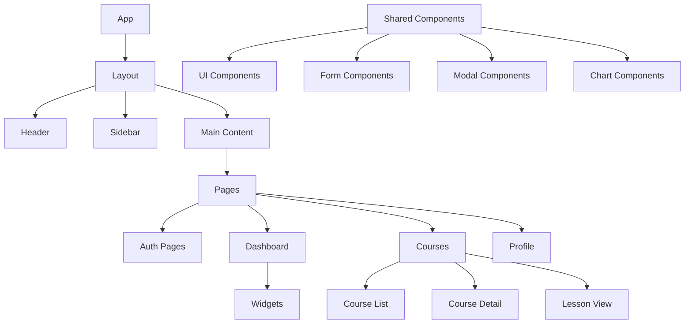

# Frontend Components

## Component Architecture

The frontend of the LMS is built using Next.js and React, following a component-based architecture with a focus on reusability, maintainability, and performance.

### Component Structure

## Core Components

### 1. Layout Components

1. **MainLayout**
   - Responsive layout wrapper
   - Navigation structure
   - Theme provider
   - Error boundaries

2. **Header**
   - Navigation menu
   - User menu
   - Search bar
   - Notifications

3. **Sidebar**
   - Navigation links
   - Course progress
   - Quick actions
   - Collapsible sections

### 2. Page Components

1. **Authentication Pages**
   - Login
   - Registration
   - Password reset
   - Email verification

2. **Dashboard**
   - Overview widgets
   - Progress tracking
   - Recent activity
   - Quick actions

3. **Course Pages**
   - Course listing
   - Course details
   - Lesson viewer
   - Assignment submission

4. **Profile Pages**
   - User profile
   - Settings
   - Achievements
   - Certificates

### 3. Shared Components

1. **UI Components**
   - Buttons
   - Cards
   - Tables
   - Typography
   - Icons
   - Loaders

2. **Form Components**
   - Input fields
   - Select dropdowns
   - Checkboxes
   - Radio buttons
   - File upload
   - Rich text editor

3. **Modal Components**
   - Dialog boxes
   - Confirmation modals
   - Form modals
   - Alert modals

4. **Chart Components**
   - Progress charts
   - Analytics charts
   - Performance graphs
   - Statistics displays

## State Management

1. **Global State**
   - User authentication
   - Theme preferences
   - Application settings
   - Notifications

2. **Local State**
   - Form data
   - UI state
   - Component-specific data
   - Temporary data

3. **Server State**
   - API data
   - Cached data
   - Real-time updates
   - Optimistic updates

## Routing

1. **Route Structure**
   - Public routes
   - Protected routes
   - Dynamic routes
   - Nested routes

2. **Route Guards**
   - Authentication checks
   - Role-based access
   - Tenant validation
   - Feature flags

## Performance Optimization

1. **Code Splitting**
   - Route-based splitting
   - Component lazy loading
   - Dynamic imports
   - Bundle optimization

2. **Caching**
   - API response caching
   - Static page generation
   - Image optimization
   - Asset caching

3. **Rendering**
   - Server-side rendering
   - Static generation
   - Incremental static regeneration
   - Client-side rendering

## Styling

1. **Theme System**
   - Color palette
   - Typography
   - Spacing
   - Breakpoints

2. **Component Styles**
   - Tailwind CSS
   - CSS Modules
   - Styled Components
   - CSS-in-JS

3. **Responsive Design**
   - Mobile-first approach
   - Breakpoint system
   - Flexible layouts
   - Adaptive components

## Accessibility

1. **ARIA Labels**
   - Semantic HTML
   - Role attributes
   - State management
   - Keyboard navigation

2. **Screen Reader Support**
   - Alt text
   - ARIA landmarks
   - Focus management
   - Announcements

3. **Color Contrast**
   - WCAG compliance
   - Theme variations
   - High contrast mode
   - Color blind support

## Internationalization

1. **Language Support**
   - Translation system
   - RTL support
   - Date formatting
   - Number formatting

2. **Content Localization**
   - Text content
   - Media content
   - Currency
   - Time zones

## Testing

1. **Unit Tests**
   - Component testing
   - Hook testing
   - Utility testing
   - State testing

2. **Integration Tests**
   - Page testing
   - Flow testing
   - API integration
   - State management

3. **E2E Tests**
   - User flows
   - Critical paths
   - Cross-browser testing
   - Performance testing

## Development Guidelines

1. **Code Organization**
   - Component structure
   - File naming
   - Import order
   - Code comments

2. **Best Practices**
   - React hooks
   - Performance patterns
   - Error handling
   - Type safety

3. **Documentation**
   - Component docs
   - Storybook
   - API documentation
   - Usage examples 