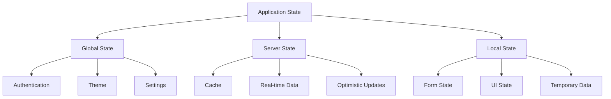

# Frontend State Management

## State Management Architecture

The LMS frontend uses a hybrid state management approach, combining Zustand for global state and React Query for server state management.

### State Categories



## Global State (Zustand)

### 1. Authentication Store

```typescript
interface AuthState {
  user: User | null;
  token: string | null;
  isAuthenticated: boolean;
  login: (credentials: Credentials) => Promise<void>;
  logout: () => void;
  refreshToken: () => Promise<void>;
}
```

### 2. Theme Store

```typescript
interface ThemeState {
  mode: "light" | "dark";
  primaryColor: string;
  toggleMode: () => void;
  setPrimaryColor: (color: string) => void;
}
```

### 3. Settings Store

```typescript
interface SettingsState {
  language: string;
  notifications: boolean;
  setLanguage: (lang: string) => void;
  toggleNotifications: () => void;
}
```

## Server State (React Query)

### 1. Query Configuration

```typescript
const queryClient = new QueryClient({
  defaultOptions: {
    queries: {
      staleTime: 5 * 60 * 1000,
      cacheTime: 30 * 60 * 1000,
      retry: 3,
      refetchOnWindowFocus: false,
    },
  },
});
```

### 2. Data Fetching

```typescript
const useCourses = () => {
  return useQuery({
    queryKey: ["courses"],
    queryFn: fetchCourses,
    select: (data) => data.courses,
  });
};
```

### 3. Mutations

```typescript
const useCreateCourse = () => {
  return useMutation({
    mutationFn: createCourse,
    onSuccess: () => {
      queryClient.invalidateQueries(["courses"]);
    },
  });
};
```

## Local State

### 1. Form State (React Hook Form)

```typescript
const useCourseForm = () => {
  const form = useForm<CourseFormData>({
    defaultValues: {
      title: "",
      description: "",
      duration: 0,
    },
    resolver: zodResolver(courseSchema),
  });
  return form;
};
```

### 2. UI State

```typescript
const useModal = () => {
  const [isOpen, setIsOpen] = useState(false);
  const [data, setData] = useState<any>(null);

  const open = (modalData?: any) => {
    setData(modalData);
    setIsOpen(true);
  };

  const close = () => {
    setIsOpen(false);
    setData(null);
  };

  return { isOpen, data, open, close };
};
```

## State Persistence

### 1. Local Storage

```typescript
const usePersistedState = <T>(key: string, initialValue: T) => {
  const [state, setState] = useState<T>(() => {
    const persisted = localStorage.getItem(key);
    return persisted ? JSON.parse(persisted) : initialValue;
  });

  useEffect(() => {
    localStorage.setItem(key, JSON.stringify(state));
  }, [key, state]);

  return [state, setState] as const;
};
```

### 2. Session Storage

```typescript
const useSessionState = <T>(key: string, initialValue: T) => {
  const [state, setState] = useState<T>(() => {
    const persisted = sessionStorage.getItem(key);
    return persisted ? JSON.parse(persisted) : initialValue;
  });

  useEffect(() => {
    sessionStorage.setItem(key, JSON.stringify(state));
  }, [key, state]);

  return [state, setState] as const;
};
```

## State Synchronization

### 1. Real-time Updates

```typescript
const useRealtimeData = (channel: string) => {
  const queryClient = useQueryClient();

  useEffect(() => {
    const subscription = subscribeToChannel(channel, (data) => {
      queryClient.setQueryData(["data", channel], data);
    });

    return () => subscription.unsubscribe();
  }, [channel]);
};
```

### 2. Optimistic Updates

```typescript
const useOptimisticUpdate = () => {
  const queryClient = useQueryClient();

  const updateData = async (newData: any) => {
    await queryClient.cancelQueries(["data"]);
    const previousData = queryClient.getQueryData(["data"]);

    queryClient.setQueryData(["data"], newData);

    try {
      await updateServer(newData);
    } catch (error) {
      queryClient.setQueryData(["data"], previousData);
    }
  };

  return { updateData };
};
```

## State Migration

### 1. Version Control

```typescript
interface StateVersion {
  version: number;
  migrate: (state: any) => any;
}

const stateVersions: StateVersion[] = [
  {
    version: 1,
    migrate: (state) => ({
      ...state,
      newField: "default",
    }),
  },
];
```

### 2. Migration Process

```typescript
const migrateState = (state: any, currentVersion: number) => {
  let migratedState = state;

  for (const version of stateVersions) {
    if (version.version > currentVersion) {
      migratedState = version.migrate(migratedState);
    }
  }

  return migratedState;
};
```

## Best Practices

### 1. State Organization

- Keep state minimal and normalized
- Use selectors for derived state
- Implement proper TypeScript types
- Document state structure

### 2. Performance

- Implement proper memoization
- Use selective updates
- Avoid unnecessary re-renders
- Monitor state changes

### 3. Error Handling

- Implement proper error boundaries
- Handle loading states
- Provide fallback UI
- Log errors appropriately

### 4. Testing

- Test state changes
- Mock external dependencies
- Test error scenarios
- Verify state persistence
